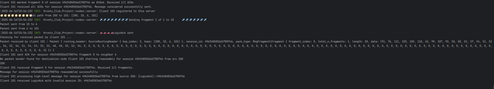
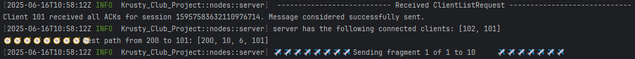
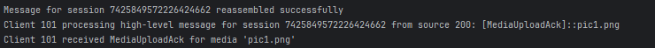
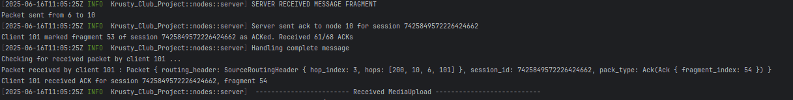
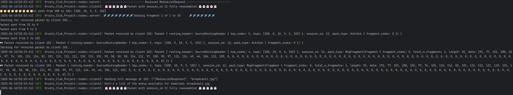
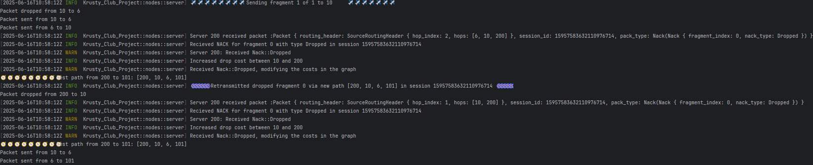

# Server Module (`server.rs`)

This file defines the behavior of a server in a peer-to-peer drone networked chat system.
The server acts as a hybrid of a chat server and a media server.
It handles packet transmission, message reassembly, client registration, media storing, media broadcasting and dynamic topology updates.
The server is the element of the network that ensures the right client-to-client communication. It takes commands also from GUI.
---

## 📦 Imports and Crate Dependencies

Includes:
- `petgraph`: graph operations and Dijkstra algorithm.
- `crossbeam_channel`: multi-producer, multi-consumer channels.
- `wg_2024`: custom packet and network data types.
- `log`, `rand`, `std`, and `eframe` for GUI integration and logging features.

---

## 🌐 `struct NetworkGraph`
The NetworkGraph struct plays a central role in maintaining a live view of the network topology and ensuring reliable routing between nodes.

### Purpose:
Represents the network as a bidirectional graph where nodes are clients, drones, or servers.

### Fields:
- `graph: DiGraph<NodeId, usize>`: Directed graph where nodes represents clients, drones and servers. Each of them has a link with its neighbor that has a value <usize> representing the cost of that connection. This cost is modified according to Nack packet reception.
- `node_indices: HashMap<NodeId, NodeIndex>`: Map NodeId to index.
- `node_types: HashMap<NodeId, NodeType>`: Type mapping (to map easily each node with its own type: Server, Client or Drone).

### Methods:
- `new()`: Initialize an empty graph.
- `add_node(id, type)`: Insert a node if missing or update type.
- `add_link(a, a_type, b, b_type)`: Bidirectional edge with weight 1.
- `remove_node(id)`: Remove node and clean mappings.
- `increment_drop(a, b)`: Increases weight of edge after drop --> this is how the path gets penalized, promoting rerouting with "cheaper" links.
- `best_path(src, tgt)`: Finds lowest-cost path using Dijkstra. Here server nodes are penalized with a large artificial cost unless they're the final destination.
- `set_node_type(id, type)`: Associate node ID with a type, allowing the system to differentiate routing behavior (e.g., avoiding servers when relaying messages).
- `get_node_type(id)`: Retrieve the node type.
- `print_graph()`: Log current graph state with edge weights --> used testing phase.

---

## 🖥 `struct server`

### Purpose:
Handles incoming and outgoing packets, client interaction, flooding for discovery, and media/chat history.
```rust

#[derive(Debug, Clone)]
pub struct server {
pub id: u8, // Server ID
pub received_fragments: HashMap<(u64, NodeId), Vec<Option<[u8; 128]>>>, // Maps (session_id, src_id) to fragment data
pub fragment_lengths: HashMap<(u64, NodeId), u8>, // Maps (session_id, src_id) to length of the last fragment
pub packet_sender: HashMap<NodeId, Sender<Packet>>, // Hashmap containing each sender channel to the neighbors (channels to send packets to clients)
pub packet_receiver: Receiver<Packet>, // Channel to receive packets from clients/drones

    seen_floods:HashSet<(u64, NodeId)>,
    registered_clients: Vec<NodeId>,
    network_graph: NetworkGraph,
    sent_fragments: HashMap<(u64,u64), (Fragment, NodeId)>,
    chat_history: HashMap<(NodeId,NodeId), VecDeque<String>>,
    media_storage: HashMap<String, (NodeId,String)>, // media name --> (uploader_id, associated base64 encoding as String)
    simulation_log: Arc<Mutex<Vec<String>>>,
}
```
### Fields:
- `id`: Server ID.
- `received_fragments`: Hashmap used to track (session_id, src_id) to fragment data.
- `fragment_lengths`: Maps (session_id, src_id) to the length of the last fragment.
- `packet_sender`:  Hashmap containing each sender channel to the neighbors (channels to send packets to clients)
- `packet_receiver`: Communication endpoint --> Channel to receive packets from clients/drones.
- `network_graph`: Contains `NetworkGraph` logic --> each server has its own knowledge of the network.
- `registered_clients`: List of clients connected to server.
- `chat_history`: Stores client-to-client chat logs ( feature: it's available also if retrieved in a different server).
- `media_storage`: Maps media name to data and uploader ( media name --> (uploader_id, associated base64 encoding as String) ).
- `seen_floods`: Avoids re-processing old FloodRequests.
- `sent_fragments`: For retransmission in case of NACKs.
-  `simulation_log`: used for connection server log --> GUI log interface

---

## 🔁 Core Method: `run(gui_buffer_input)`
Main event loop:
First thing done: analyze the network. --> self.initiate_network_discovery()
- Polls GUI messages and handles `[FloodRequired]`, `[MediaBroadcast]`.
  Each time a message: "[FloodRequired]::{AddSender || SpawnDrone || RemoveSender}" is received self.initiate_network_discovery() is called
  Every second a GUI message is popped and handled.
- Listens for packets and dispatches to handlers:
    - `MsgFragment` → sends ack and calls self.handle_fragment(...)
    - `Ack` → no action is taken
    - `Nack` → calls self.handle_nack(...)
    - `FloodRequest` →  calls self.handle_flood_request(...)
    - `FloodResponse` → calls self.handle_flood_response(...)

---
### Connection thread on Log Gui:
#### `fn attach_log()`
Used to link self.simulation_log to the log thread.
 ``` rust 
    fn log(&self, message: impl ToString) {
        if let Ok(mut log) = self.simulation_log.lock() {
            log.push(message.to_string());
        }
    }
   ```
function to lock the thread when there is a self.log(...) method call.

## ✉️ Fragment and Message Handling

### `handle_fragment(session_id, fragment, routing_header)`
This method is responsible for:
- Storing incoming packet fragments into "received_fragments"
- If a fragment is already received --> warn!() is triggered
- If not, stores it as value: Some(fragment.data)
- Last fragment received --> update "fragment_lengths" hashmaps
- Check if all fragment have been received
- On full reassembly, calls `handle_complete_message`.

### `handle_complete_message((session_id, src_id), routing_header)`
1 step: Remove and retrieve the full list of fragments for the session_id and sender_id key.
2 step: Calculates the true total length of the complete message.
3 step: Initializes a buffer message with enough space for the full payload.
4 step: Iterates over all fragments, unwrapping and appending their bytes to the message buffer.
5 step: Converts the reassembled binary message into a UTF-8 String.
6 step: Splits the string using "::" as a delimiter -->(format convention used)

Parses command-based messages:
- `[Login]::server_id` : registers client_id into server.registered_clients and sends a  format!("[LoginAck]::session_id") as a response to client
  Example login from console:
  
- `[ClientListRequest]`: sends a  format!("[ClientListResponse]::{}",clients)
  Example from console:
  
  

- `[ChatRequest]::target_id`: triggers a  format!("[ChatStart]::{}",success) message to client

- `[MessageTo]::target_id::msg`: sends to target_id  format!("[MessageFrom]::{}::{}", client_id, msg). It then update self.chat_history inserting at the end of the queue the msg to the client1 - client2 entry.

- `[HistoryRequest]::src_id::tgt_id`: when clients wants to see chronology sends  format!("[HistoryResponse]::{}", response)

- `[ChatHistoryUpdate]::src_server::serialized_entry`: used to take updates of chat histories from other servers 🚨🚨🚨🚨

- `[MediaUpload]::media_name::base64`: insert in media_storage a media --> sends format!("[MediaUploadAck]::{}", media_name)
  Examples from log:
  
- `[MediaListRequest]`: sends format("[MediaListResponse]::{}", list)  where list contains all medias available on server.
  

- `[MediaDownloadRequest]::media_name`:  sends format!("[MediaDownloadResponse]::{}::{}", media_name, base64_data)

- `[MediaBroadcast]::media_name::base64_data`: sends to all clients in self.registered_clients a format!("[MediaDownloadResponse]::{}::{}", media_name, base64_data),
  then it sends an acknowledgement format!("[MediaBroadcastAck]::{}::Broadcasted", media_name)

- `[ChatFinish]::target_client`: when a ChatFinish is received the server takes the chronology between target_client e client.id and sends to every server in the topology a format!("[ChatHistoryUpdate]::{}::{}", self.id, serialized), where serialized is the complete chat history between the pair of clients.

- `[Logout]`: removes from registered_clients hashmap the client.id 👀👀👀👀

---

## 📡 Routing & Acknowledgements

### `send_chat_message(session_id, target_id, msg)`

Sends a message from the server to a client by splitting it into fragments, computing the best route, and transmitting the fragments via the appropriate neighbors.
📦 Purpose:
Messages that are too large to fit in a single packet are fragmented into 128-byte chunks, routed to the target using the shortest path, and sent one-by-one through the network.

- Fragments the message.
- Computes best path.
- Sends to next hop. ️✈️️✈️️✈️️✈️
- Records in `sent_fragments` for potential retransmit due to Nack .

### `send_ack(packet, fragment)`
- Builds an ACK packet and sends it along reversed route.

---

## 🚨 Error Recovery

### `handle_nack(session_id, nack, packet, header)`
- For `NackType::Dropped`: increase graph weight calling self.network_graph.increment_drop( from, to) and resend the packet using new best path ⌚⌚⌚⌚.
  Example from console log:
  
- For `NackType::ErrorInRouting`: remove crashed drone by calling self.network_graph.remove_node(crashed_node_id).
- For other types: send new `FloodRequest`.

---

## 🌊 Network Discovery

### `initiate_network_discovery()`
- Broadcasts a `FloodRequest` to every neighbour is self.packet_sender with a random `flood_id`.

### `handle_flood_request(session_id, flood_request, _)`
- If seen before → sends `FloodResponse` with server now pushed in response.path_trace
- If new → forwards `FloodRequest` to neighbors.

### `handle_flood_response(session_id, flood_response, header)`
- Integrates new links into `network_graph`.


